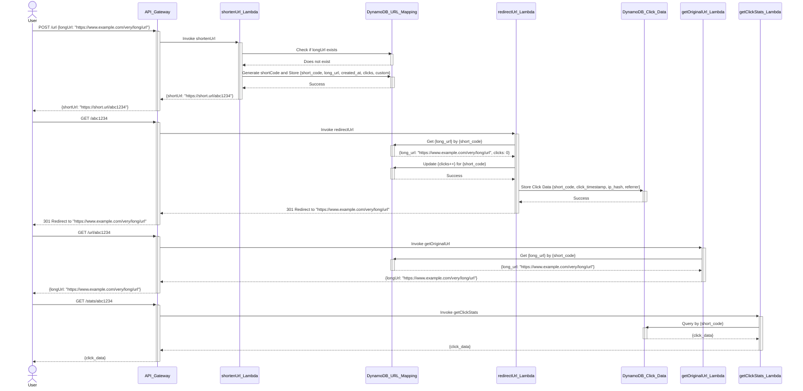

```mermaid

sequenceDiagram

    actor User
    participant API_Gateway
    participant shortenUrl_Lambda
    participant DynamoDB_URL_Mapping
    participant redirectUrl_Lambda
    participant DynamoDB_Click_Data
    participant getOriginalUrl_Lambda
    participant getClickStats_Lambda

    %% Shorten URL Use Case
    User->>+API_Gateway: POST /url {longUrl: "https://www.example.com/very/long/url"}
    activate API_Gateway
    API_Gateway->>+shortenUrl_Lambda: Invoke shortenUrl
    activate shortenUrl_Lambda
    shortenUrl_Lambda->>DynamoDB_URL_Mapping: Check if longUrl exists
    activate DynamoDB_URL_Mapping
    DynamoDB_URL_Mapping-->>-shortenUrl_Lambda: Does not exist
    shortenUrl_Lambda->>+DynamoDB_URL_Mapping: Generate shortCode and Store {short_code, long_url, created_at, clicks, custom}
    activate DynamoDB_URL_Mapping
    DynamoDB_URL_Mapping-->>-shortenUrl_Lambda: Success
    deactivate DynamoDB_URL_Mapping
    shortenUrl_Lambda-->>-API_Gateway: {shortUrl: "https://short.url/abc1234"}
    deactivate shortenUrl_Lambda
    API_Gateway-->>-User: {shortUrl: "https://short.url/abc1234"}
    deactivate API_Gateway

    %% Redirect URL Use Case
    User->>+API_Gateway: GET /abc1234
    activate API_Gateway
    API_Gateway->>+redirectUrl_Lambda: Invoke redirectUrl
    activate redirectUrl_Lambda
    redirectUrl_Lambda->>+DynamoDB_URL_Mapping: Get {long_url} by {short_code}
    activate DynamoDB_URL_Mapping
    DynamoDB_URL_Mapping-->>-redirectUrl_Lambda: {long_url: "https://www.example.com/very/long/url", clicks: 0}
    deactivate DynamoDB_URL_Mapping
    redirectUrl_Lambda->>+DynamoDB_URL_Mapping: Update {clicks++} for {short_code}
    activate DynamoDB_URL_Mapping
    DynamoDB_URL_Mapping-->>-redirectUrl_Lambda: Success
    deactivate DynamoDB_URL_Mapping
    redirectUrl_Lambda->>+DynamoDB_Click_Data: Store Click Data {short_code, click_timestamp, ip_hash, referrer}
    activate DynamoDB_Click_Data
    DynamoDB_Click_Data-->>-redirectUrl_Lambda: Success
    deactivate DynamoDB_Click_Data
    redirectUrl_Lambda-->>-API_Gateway: 301 Redirect to "https://www.example.com/very/long/url"
    deactivate redirectUrl_Lambda
    API_Gateway-->>-User: 301 Redirect to "https://www.example.com/very/long/url"
    deactivate API_Gateway

    %% Get Original URL Use Case
    User->>+API_Gateway: GET /url/abc1234
    activate API_Gateway
    API_Gateway->>+getOriginalUrl_Lambda: Invoke getOriginalUrl
    activate getOriginalUrl_Lambda
    getOriginalUrl_Lambda->>+DynamoDB_URL_Mapping: Get {long_url} by {short_code}
    activate DynamoDB_URL_Mapping
    DynamoDB_URL_Mapping-->>-getOriginalUrl_Lambda: {long_url: "https://www.example.com/very/long/url"}
    deactivate DynamoDB_URL_Mapping
    getOriginalUrl_Lambda-->>-API_Gateway: {longUrl: "https://www.example.com/very/long/url"}
    deactivate getOriginalUrl_Lambda
    API_Gateway-->>-User: {longUrl: "https://www.example.com/very/long/url"}
    deactivate API_Gateway

    %% Get Click Stats Use Case
    User->>+API_Gateway: GET /stats/abc1234
    activate API_Gateway
    API_Gateway->>+getClickStats_Lambda: Invoke getClickStats
    activate getClickStats_Lambda
    getClickStats_Lambda->>+DynamoDB_Click_Data: Query by {short_code}
    activate DynamoDB_Click_Data
    DynamoDB_Click_Data-->>-getClickStats_Lambda: {click_data}
    deactivate DynamoDB_Click_Data
    getClickStats_Lambda-->>-API_Gateway: {click_data}
    deactivate getClickStats_Lambda
    API_Gateway-->>-User: {click_data}
    deactivate API_Gateway
```